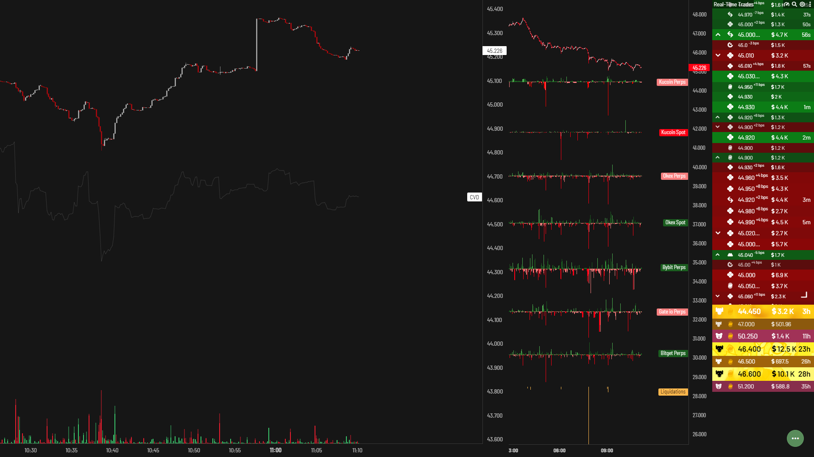
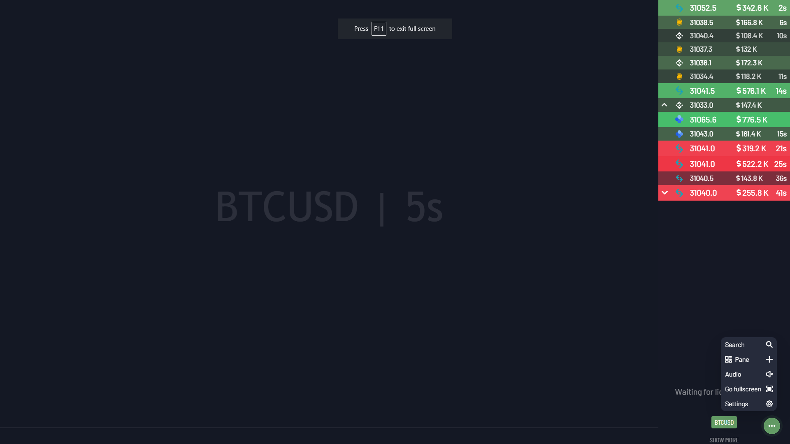
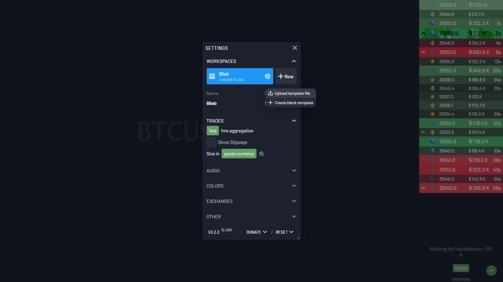

# Aggr-Scripts-BSV

## Intro
A significant trades (aggr) script for Bitcoin SV (BSV) markets based on the [CryptoRife template](https://github.com/cryptorife/aggr-templates).

## Historical data

Unfortunately, there is currently no historical data support for BSV. It would be possible to spin a dedicated influxDB server and build a client pointing to the db. This is something I might entertain in the future if there is a demand. Currently, if you want to load the exchange specific delta data, you have to do so directly in the browser. Real-time exchange data is loaded into the browser via websocket. You can alter the refresh rate in the app I think the default is 1 second.

## Tutorial

* Download the `rifeBSV.txt` file from GitHub
* Navigate to https://charts.aggr.trade/ in you browser
* Select the `Settings` icon in the bottom right of the screen

* Select the `NEW` option from the menu
* Select the `Upload Template File` option and choose the `rifeBSV.txt` file that you downloaded earlier.

That's it! It will take 5-10 minutes for the historical data to start loading in vue. If you leave your browser open, the hisotical data will load indefinitely until the UI is refreshed, this includes changing time-frame on the chart.

If you would like to donate, all funds will be saved at this address and used for adding historical data and building a custom client for BSV: `1LjaNMNNcLAseMkCkkZ9J7UoQAYV7A6Tij`